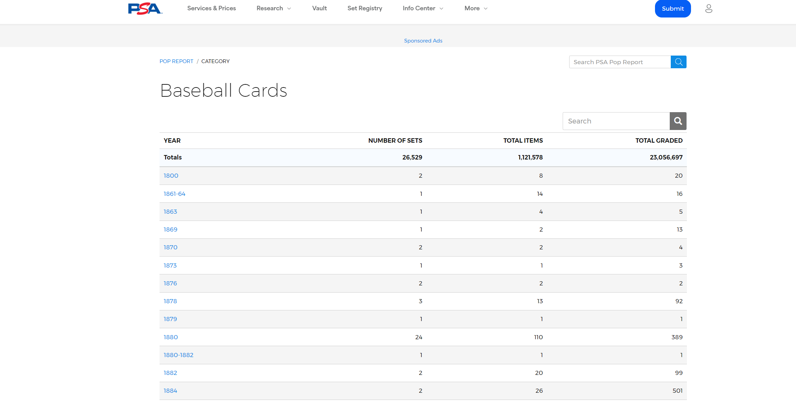

## Background of Sport Card Grading
Sports card collecting is a hobby enjoyed by many around the world. People like to collect cards from their favorite players and team.  There is also a lively market for buying and selling sports cards.  One of the factors that determines the value of the card is the condition that it is in. Companies like the Professional Sports Authenticator (PSA) give the cards a grade on a scale from Authentic (i.e. 0 but real) to 10 (Gem Mint).  PSA keeps track of the cards that they have graded in a table on their website in a section called the pop report.  

## Part 1
### Exploring the tables

